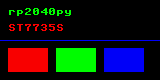
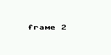
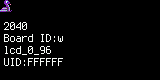
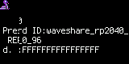
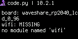
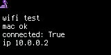

# Demos

Runnable examples. The `*_run.py` scripts are host-side programs; the `mp_*.py` files are
MicroPython code that runs *inside* the emulated firmware, pushed over the raw REPL by their
runner. The `cp_*.py` files are the CircuitPython equivalent, and get there differently:
CircuitPython auto-runs `code.py` off its CIRCUITPY drive, so they are written into a FAT12 image
the emulator loads as flash content (see `mkfat12.py`) instead of being pushed over the REPL.

| script | what it does |
|---|---|
| [`emulator_run.py`](emulator_run.py) | raw `.hex`/`.uf2` program, GDB server on 3333 (`rp2040py run`) |
| [`micropython_run.py`](micropython_run.py) | MicroPython/CircuitPython REPL (`rp2040py micropython`) |
| [`kaluma_run.py`](kaluma_run.py) | Kaluma REPL (`rp2040py kaluma`) |
| [`benchmark.py`](benchmark.py) | instruction-throughput benchmark (`rp2040py bench`) |
| [`mklittlefs_dump.py`](mklittlefs_dump.py) | build/inspect a littlefs image |
| [`mkfat12.py`](mkfat12.py) | build/inspect a CIRCUITPY (FAT12) image - `code.py`, `boot.py`, `boot_out.txt` |
| [`eink_run.py`](eink_run.py) + [`mp_eink_demo.py`](mp_eink_demo.py) | virtual Waveshare 2.9″ e-Paper (G) over SPI1, with a from-scratch driver |
| [`lcd_run.py`](lcd_run.py) + [`mp_lcd_demo.py`](mp_lcd_demo.py) / [`cp_lcd_demo.py`](cp_lcd_demo.py) | Waveshare RP2040-LCD-0.96's onboard 160×80 ST7735S panel, MicroPython or CircuitPython |
| [`wifi_lcd_run.py`](wifi_lcd_run.py) + [`cp_wifi_lcd_demo.py`](cp_wifi_lcd_demo.py) | a Pico W's CYW43439 *and* an ST7735S wired to it: a CircuitPython WiFi join, on screen |

`mkfat12.py` writes root-level 8.3 names on its own, with nothing installed. A long name or a path
(`settings.toml`, `lib/greeter.py`) needs VFAT/LFN entry chains it deliberately doesn't implement,
so it hands those images to `pyfatfs` - declared in that script's own PEP 723 header, so
`uv run --script demo/mkfat12.py ...` installs it for that script alone and the project itself
takes no dependency on it. [Record 0086](../docs/records/0086-fat12-library-and-a-mkfat12-subcommand.md)
is the plan for making that a real optional dependency plus a `mkfat12` CLI subcommand, and the
survey of the libraries that could back it.

## What the display demos actually produce

Every image below came out of the emulator - each is the raw framebuffer a device emitted
(`on_frame`), decoded to PNG by the runner that ran it. Shown scaled up; the files in
[`screenshots/`](screenshots/) are the panels' real pixel sizes.

### `lcd_run.py` - ST7735S, 160×80

```sh
uv run --with pillow python demo/lcd_run.py --screenshot out
```

MicroPython, driven by `mp_lcd_demo.py` (a port of Waveshare's own sample driver):




```sh
uv run --with pillow python demo/lcd_run.py --circuitpython --screenshot out
```

CircuitPython, with **no guest code at all** - that firmware initialises the panel in
`board_init()` and repaints it itself, so booting the board is the whole demo. The frames are
partial repaints, which is exactly how the firmware draws:




CircuitPython again, this time with a guest `code.py` - `--code` writes one into a CIRCUITPY
(FAT12) image the emulator loads as flash content, and the panel *is* CircuitPython's console on
this board, so whatever it prints is drawn there (the status bar reads `code.py` while it runs):

```sh
uv run --with pillow python demo/lcd_run.py --circuitpython --code demo/cp_lcd_demo.py \
    --screenshot out --frames 0 --timeout 200
```



That `wifi: MISSING` is the honest answer to "would a WiFi connection show up here?" on *this*
board: it has no CYW43439, so its CircuitPython build ships no `wifi` module at all. `wifi_lcd_run.py`
below is where a real join happens. `--boot` works the same way but is invisible to any
screenshot - CircuitPython sends `boot.py`'s output to `boot_out.txt` instead of the console, so
`--dump-fs after.img` plus `python demo/mkfat12.py --base after.img --read boot_out.txt` is how to
read it. Both findings are [record 0085](../docs/records/0085-circuitpython-code-py-and-wifi-on-screen.md).

The two runs also drive the panel through *different* orientations (`MADCTL` `0xA8` vs `0xC8`,
with transposed window offsets); both come out upright because the emulated controller applies
that mapping - see [record 0056](../docs/records/0056-st7735s-waveshare-lcd-board.md).

### `wifi_lcd_run.py` - a WiFi join, on the panel

The same ST7735S, wired to a **Pico W** instead of being soldered to a Waveshare board - so the
run has both an emulated CYW43439 and an emulated panel, and `code.py` builds the display itself
(a Pico W's `board_init()` builds none):

```sh
uv run --with pillow python demo/wifi_lcd_run.py --screenshot out
```



That IP comes from the emulator's own DHCP server, over the NAT bridge
([record 0048](../docs/records/0048-cyw43-nat-reflector.md)); the panel scrolls one more line
afterwards to show the gateway. Expect it to be slow - the CYW43's PIO/gSPI path is the heaviest
thing in this emulator, which is also why the guest code refreshes the display by hand instead of
leaving `auto_refresh` on.

### `eink_run.py` - Waveshare 2.9″ e-Paper (G), 128×296

```sh
uv run --with pillow python demo/eink_run.py --screenshot out
```

First and last frames of the sunrise animation (4-colour BWYR panel, so the sky quantises to
white and the sun to yellow/red):


Both runners also take `--tkinter` for a live window instead of PNGs, and `--timeout` to bound a
run. See
[docs/reference/external-devices-and-boards.md](../docs/reference/external-devices-and-boards.md)'s
"Seeing what a display device drew" for how to point either at your own device.
